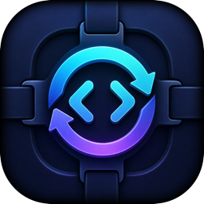

<div align="center">
  
  <h1>Codeness</h1>
  <p><strong>Give Codeness a goal and supervise autonomous work from one native macOS window.</strong></p>
</div>

Codeness coordinates locally installed Codex and Claude Code command-line agents, plus an optional OpenAI-compatible endpoint. You describe the complete outcome once. Codeness prepares the working goal, chooses a small ordered set of agents, routes work between them, and changes that setup when evidence shows it should.

## Why Codeness?

- Start with the outcome. Provider, model, cost, memory, and authority limits belong in the same goal.
- Let Codeness choose and adjust the agents instead of configuring a fixed process first.
- Give each agent its own memory, a deliberately shared conversation, or a fresh conversation every turn.
- Inspect every turn, handoff, change, timing measurement, and token count. Pause, steer, edit the fixed goal, and resume from saved state.
- Keep repository ownership explicit. Codeness initializes Git when the selected folder is not already in a repository. It does not create worktrees, stash, commit, reset, or add orchestration files itself. Its agents may do so only when the goal and their instructions authorize it.

## How it works

```text
Your goal
    |
    v
Codeness prepares a working goal, agents, targets, and memory choices
    |
    v
An agent takes one bounded turn; Codeness chooses the next handoff
    |
    v
The Overseer adjusts the agents when evidence warrants it
    |
    v
The Overseer completes only when the fixed goal has no work left
```

Recurring agents return once per round. One-time agents retire after their first accepted turn unless their responsibility or the working goal changes. Agent changes take effect only between turns, after the current state is saved. Each strategy or completion review appears as a selectable chapter in the turn list. Its detail view shows the consulted manager perspectives, their short reports, the Overseer's judgment, and any resulting agent setup without asking for approval.

Codeness reviews strategy after three rounds or twelve agent turns, after repeated failure, when local routing asks for help, and before final completion. Automatic periodic reviews also have a ten-minute cooldown, so fast rounds cannot create a review loop; time alone never starts work. Internal stage boundaries never ask the user for direction.

The implementation and tradeoffs are recorded in [Goal-directed orchestration](Documentation/live-loop-redesign.md).

## Get started

### Requirements

To run Codeness:

- macOS 15 or newer on Apple silicon.
- At least one supported agent:
  - `codex` 0.145.0 or newer, with App Server support;
  - Claude Code with the streaming JSON protocol used by Codeness; or
  - an OpenAI-compatible Chat Completions endpoint and model.

To build from source, install Xcode 27 and [XcodeGen](https://github.com/yonaskolb/XcodeGen) 2.38.0 or newer. The canonical Release install also needs a Developer ID Application certificate for account `W65292CD8T` and a `notarytool` Keychain profile. The default profile is `brrainz-notary`.

Codeness uses the existing authentication of Codex and Claude Code. For an OpenAI-compatible endpoint, it reads an optional API key from the configured JSON file and property without storing the key itself.

### Build and install

```sh
git clone https://github.com/pardeike/Codeness.git
cd Codeness
./scripts/build-quiet.sh
open /Applications/Codeness.app
```

The script generates the Xcode project, builds and signs a hardened Release app, notarizes and staples it, verifies it with Gatekeeper, and installs it at `/Applications/Codeness.app`. It replaces the installed app only after the pre-installation checks pass. Project settings live in `project.yml`; the generated `.xcodeproj` is ignored.

Use `CODENESS_CODESIGN_IDENTITY` for another Developer ID identity and `CODENESS_NOTARY_PROFILE` for another saved profile. If either lives outside the normal Keychain search list, set `CODENESS_CODESIGN_KEYCHAIN` or `CODENESS_NOTARY_KEYCHAIN`. The scripts do not store credentials or pass Keychain passwords on the command line.

### Start an activity

1. Choose **File > New Project…** to name and locate a new empty folder, or choose **Open Workspace…** for an existing folder. Codeness initializes Git if needed.
2. Describe the complete desired outcome. Include restrictions such as “use only Codex gpt-5.6-terra,” spending limits, memory requirements, and publishing authority.
3. Select **Start**.
4. Follow agent turns and Codeness's current read-only agent setup in the window.

The selected folder is not silently replaced by a parent Git root. Different subfolders of one working tree can have independent Codeness documents.

## During an activity

- **Pause** stops after the current result and handoff reach a saved boundary. Any strategy or completion review requested by that handoff waits for Resume.
- **Stop Now** interrupts the active turn. Resume recovers from the saved assignment and current repository state.
- **Change Goal** takes effect immediately while paused or between turns while running, then triggers a strategy review.
- Codeness chooses one-time or recurring agents and their memory policy as part of its strategy.
- **Start Over** is available after completion. It archives the activity, releases its sessions, and prefills a new activity with the previous or amended goal. Repository files stay untouched.

An ordinary handoff can nominate completion but cannot finish the activity. The Overseer uses the fixed goal and saved evidence at the same strategic decision point that controls the agent setup.

Agent tool and file operations run without Codeness approval prompts. Agents are instructed to make reversible internal decisions themselves and report unavailable external authority to Codeness instead of asking the user to manage a stage. Standard-mode agents and compatible-provider tools are not sandboxed; they have the account-level file and process access of Codeness.

## Agent providers

Open **Codeness → Settings** to configure executable discovery, the optional OpenAI-compatible endpoint, and transcript presentation. Agent targets are chosen from the providers currently ready when an activity starts or strategy changes.

The first control turn must choose a target before any agent can interpret the goal. If the goal contains one unambiguous, non-negated provider or exact model identifier, Codeness uses that target first. Otherwise it uses the first ready target and chooses subsequent targets from the goal. This convenience is not a complete natural-language policy checker; complex restrictions still require review and evidence.

Codex models and service tiers come from the running App Server. Claude aliases, resolved models, effort levels, and Fast eligibility come from Claude Code's initialization handshake. OpenAI-compatible model identifiers depend on that server's configuration. Autonomous agents use normal execution mode so reviewers can run tests and desktop tools as well as inspect files.

## Permission preflight

Choose **Codeness → Check Permissions…** to inspect macOS capabilities that an activity may need. Opening the window and selecting **Refresh** perform passive checks. A macOS permission prompt appears only after **Request Access** for Accessibility or Screen Recording.

- Full Disk Access is verified only when Codeness can open a protected probe file without reading it.
- Files & Folders access is granted on demand for individual protected locations.
- Accessibility and Screen Recording use public status and request APIs.
- System Audio Recording has no public generic request API, so Codeness links to its Privacy & Security pane without treating Screen Recording as proof.
- Automation is managed separately for each target app. Developer Tools and App Management require verification in System Settings.

Codeness does not preflight or request microphone, camera, contacts, calendars, notifications, input monitoring, or local-network access. Reopen the app when System Settings requests it before starting long unattended work.

## Data, export, and recovery

Codeness stores activity state, agent changes, turn payloads, transcripts, recovery logs, and window state under:

```text
~/Library/Application Support/Codeness
```

**File → Save** flushes Codeness metadata only. It never replaces the selected repository as a document.

**File → Export Workspace…** creates a Finder-native `.codeness` file. Running work first pauses at a coherent checkpoint. The export contains the goal, current agent setup, change history, turns, transcripts, recovery checkpoints, and window state. It excludes the repository itself, provider authentication, command-line installations, and app-wide preferences.

Opening or importing the file on another Mac uses the original repository path when available and otherwise asks for its location. Imported work opens paused with fresh provider conversations because provider session identifiers are local to the source Mac. Existing Codeness state is backed up before replacement.

Codeness continuously saves crash-recovery boundaries. Closing a window or quitting stops active provider work and saves a resumable state; no activity continues invisibly in the background. Reopened active documents remain paused until explicitly resumed.

Active documents made by earlier versions adapt automatically on open and remain paused for review. If one has no usable goal, Codeness asks only for that goal. Completed and cancelled older activities remain unchanged as history.

## Development

Generate the project and run the tests:

```sh
xcodegen generate
./scripts/test-quiet.sh
```

Before declaring a production change complete, run:

```sh
./scripts/build-quiet.sh
```

The completion build must install and verify `/Applications/Codeness.app`. For isolated development that must not touch production state, use `./scripts/build-prototype-quiet.sh`; it installs `/Applications/Codeness Prototype.app` with a separate bundle identifier and Application Support directory.
