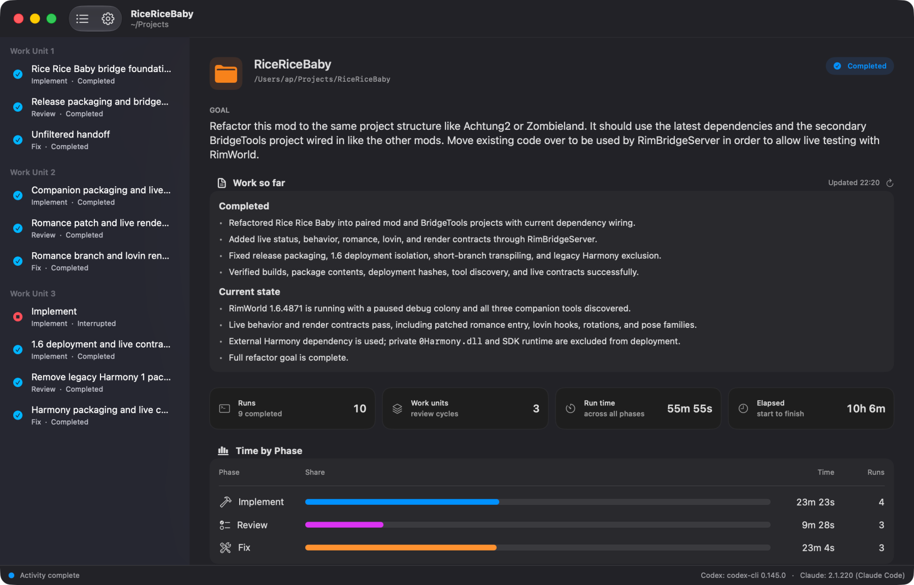

<div align="center">
  
  <h1>Codeness</h1>
  <p><strong>Supervise repeatable Codex and Claude workflows from one native macOS window.</strong></p>
  <p>Give Codeness a goal, choose a workflow, and let specialized agent sessions implement, review, and refine the work until the whole goal is complete.</p>
</div>



Codeness is a workflow supervisor—not another coding agent. It coordinates your locally installed Codex and Claude Code CLIs inside the work folder you choose, keeps each step's session alive across cycles, and gives you one place to follow, pause, steer, and resume the work.

## Why Codeness?

- **Use the right agent for each step.** Mix Codex and Claude, models, reasoning effort, native read-only Plan mode, and Fast mode within one workflow.
- **Build review into the process.** Run an implementation/review/fix loop until a coordinator determines that the complete goal—not merely the latest task—is finished.
- **Keep the work observable.** Inspect reasoning, actions, diagnostics, final answers, handoffs, timing, and token usage for every run.
- **Pause without losing the thread.** Persistent step sessions, saved checkpoints, and crash recovery make long-running work practical.
- **Stay in control of the repository.** Codeness does not create worktrees, stash, commit, reset, or add orchestration files to your project.

## How it works

A workflow has up to three ordered sections:

```text
Before loop (once)     Repeating loop                         After completion (once)
┌───────────────┐      ┌───────────────────────────────┐      ┌───────────────────────┐
│ Plan          │ ───▶ │ Implement → Review → Fix  ↻   │ ───▶ │ Finalize, report, …   │
└───────────────┘      └───────────────────────────────┘      └───────────────────────┘
```

After every step, a configurable coordinator creates a conservative handoff for the next agent. At the end of a repeating cycle, it decides whether the full goal is complete, another cycle is needed, or the workflow should pause for your input.

Codeness includes three ready-to-use workflows:

| Workflow | Shape | Good for |
| --- | --- | --- |
| **Implement / Review / Fix** | Implement → Review → Fix ↻ | Careful, iterative development with a dedicated correction pass |
| **Code / Review** | Code → Review ↻ | A leaner alternation between implementation and read-only inspection |
| **Plan + Implement / Review / Fix** | Plan → (Implement → Review → Fix) ↻ | Larger work that benefits from a read-only planning pass first |

Every bundled workflow can be edited, duplicated, or used as the starting point for a custom workflow.

## Get started

### Requirements

To run Codeness:

- macOS 15 or newer on Apple silicon
- At least one supported, authenticated agent CLI:
  - `codex` 0.145.0 or newer, with App Server support
  - Claude Code 2.1.220 or newer

To build Codeness from source, you also need Xcode 27 and [XcodeGen](https://github.com/yonaskolb/XcodeGen) 2.38.0 or newer.

Codeness uses the existing authentication of each CLI. New configurable workflows do not require separate OpenAI API credentials.

### Build and install

```sh
git clone https://github.com/pardeike/Codeness.git
cd Codeness
./scripts/build-quiet.sh
open /Applications/Codeness.app
```

The build script generates the Xcode project, creates and verifies a signed Release build, and installs it at `/Applications/Codeness.app`. The generated `.xcodeproj` is intentionally ignored; project settings live in `project.yml`.

### Run your first workflow

1. Open Codeness and choose the folder in which the agents should work. Git is optional.
2. Describe the complete outcome in **Goal**. You can also point to a specification file or folder.
3. Pick a bundled workflow.
4. Optionally choose **Customize…** to change steps, providers, models, modes, effort, or speed.
5. Select **Start** and follow the runs in the sidebar.

The folder you select is used exactly as chosen—it is not silently replaced by a parent Git root. This makes it possible to open different subfolders of the same working tree as independent Codeness workspaces.

## During a run

Each workflow step owns a persistent provider session. When the step repeats, its existing lineage resumes with the context it has already accumulated.

- The sidebar groups runs by **Before Loop**, cycle, and **After Completion**.
- Each run exposes a reasoning-first transcript with independently hideable reasoning, actions, and diagnostics.
- The final answer appears in a separate pane and is the source passed to the coordinator.
- **Pause After Current** stops cleanly after the current handoff.
- You can steer or interrupt an active turn, then resume from the saved checkpoint.
- While paused, you can adjust the provider, model, effort, mode, and speed of future steps.
- Agent tool and file operations run without approval prompts in both Standard and Plan mode. Genuine questions and other user-input requests still appear in the native interaction sheet.

Changing only effort or speed preserves a step's session lineage. Changing its provider, model, or mode starts a new lineage so incompatible context is never silently resumed.

## Customize workflows

Open **Codeness → Settings** to manage reusable workflows and agent executable paths. Automatic CLI discovery is used when an executable path is empty; a configured path is authoritative after Codeness verifies it and restarts that provider.

Every step and coordinator target can independently configure:

| Setting | Options |
| --- | --- |
| Provider | Codex or Claude |
| Model | A discovered model or an explicit model identifier |
| Effort | Any effort level supported by that model |
| Mode | Standard or native read-only Plan mode |
| Speed | Standard or provider-supported Fast mode |

Codex models and service tiers come from the running App Server's model catalog. Claude aliases, resolved models, effort levels, and Fast eligibility are discovered through Claude Code's initialization handshake.

## Repository and data boundaries

Codeness itself does not create worktrees, stash changes, commit, reset, or write orchestration files into the selected repository. Agent steps can, of course, edit the repository when their configured mode and instructions allow it.

Workflow state, transcripts, recovery logs, and window state are stored under:

```text
~/Library/Application Support/Codeness
```

App-wide preferences use the standard macOS preferences system. **File → Save** flushes Codeness metadata only; it never treats the repository as a document to replace or safe-save.

## Recovery and lifecycle

Codeness continuously saves enough state to recover long-running activities:

- Closing a window with active work first asks the provider to stop at the nearest coherent point.
- **Interrupt Now** provides an eager stop when waiting is not appropriate.
- A window closes only after the terminal turn state and resume checkpoint are saved.
- Quitting applies the same process to all active repository windows and stops app-owned providers; work never continues invisibly in the background.
- Reopened activities remain paused until you explicitly resume them.
- **Start Over** archives the old activity, clears its agent sessions, and returns to an editable copy of the previous goal and workflow. Repository files remain untouched.

Repository windows, sidebar geometry, selected runs, transcript reading positions, and follow-at-bottom state are restored between launches.

<details>
<summary><strong>Coordinator and handoff details</strong></summary>

The coordinator can use either Codex or Claude with its own model, effort, mode, and speed. It receives the completed step's final answer together with the full goal and next-step context, then returns a structured result containing:

- a conservatively filtered handoff;
- the workflow outcome; and
- a concrete label for the completed run.

A completion result is honored only after the final repeating step. Coordination failures and Blocked, Failed, or Unclear outcomes pause the workflow so you can retry or provide an edited handoff.

</details>

<details>
<summary><strong>Provider and transcript details</strong></summary>

Codex communicates through its shared App Server. Claude uses its streaming JSON CLI protocol, including session resume, partial output, usage, approvals, questions, steering, and interruption.

Successful tool chatter is suppressed by default while failures remain visible. Append-only transcripts and token-usage checkpoints are retained for crash recovery. Selecting an older run or scrolling away from the bottom disables automatic following until you return to the live transcript.

Fast mode is resolved from current provider capabilities at run time. Codeness does not persist a hidden service-tier identifier or silently substitute a different model.

</details>

<details>
<summary><strong>Compatibility with older activities</strong></summary>

Activities created by older Codeness versions retain their original Implement / Review / Fix state machine, two Codex threads, and OpenAI Responses API relay configuration. That compatibility path exists only for recovery and is not used for new activities.

</details>

## Development

Generate the project, build, and run the test suite:

```sh
xcodegen generate
xcodebuild -project Codeness.xcodeproj -scheme Codeness -destination 'platform=macOS' build
./scripts/test-quiet.sh
```

Before considering a change complete, run the canonical Release build:

```sh
./scripts/build-quiet.sh
```

It must finish by installing and verifying `/Applications/Codeness.app`.
